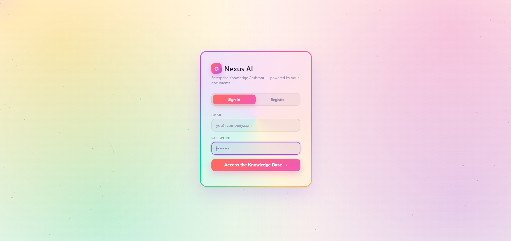
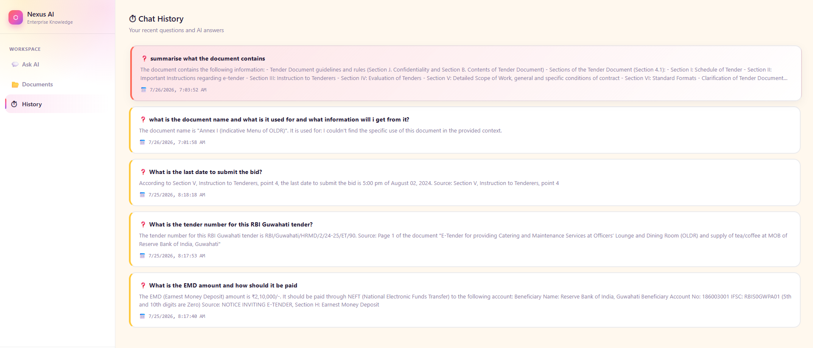
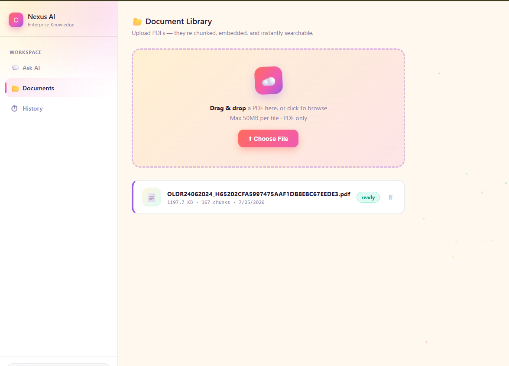
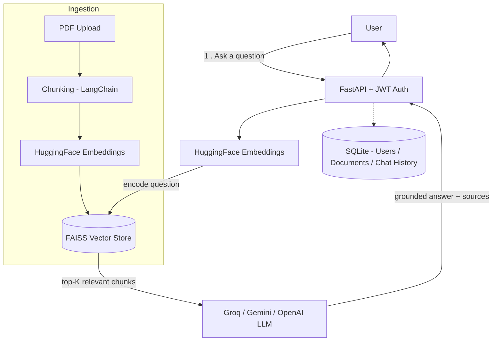

# 🧠 Enterprise AI Knowledge Assistant

Ask questions in natural language and get answers directly from your company's PDF documents — a full-stack RAG (Retrieval-Augmented Generation) application with JWT auth, role-based access control, and a live chat UI.

<p>
  
  
  
  
  
  
  
</p>

---

## 📸 Screenshots

| Sign In | Ask AI |
|---|---|
|  |  |

| Document Library | Chat History |
|---|---|
|  |  |

> Drop your PNG/JPG screenshots into a `screenshots/` folder at the project root using these filenames (or update the paths above to match yours): `login.png`, `chat.png`, `documents.png`, `history.png`.

---

## ✨ Features

- **Retrieval-Augmented Generation** — answers are grounded in your uploaded PDFs, not the model's general knowledge
- **JWT authentication** — register, log in, and every API call is protected by a bearer token
- **Role-based access control (RBAC)** — the first account ever registered becomes `admin`; a dedicated `/admin/users` route is restricted to that role
- **Document management** — drag-and-drop PDF upload, automatic chunking + embedding, per-document status tracking
- **Chat history** — every question/answer pair is persisted per user and browsable later
- **Dockerized** — one `docker-compose up` to run the whole stack

---

## 🧱 Tech Stack

| Layer | Technology |
|-------|-----------|
| Backend | FastAPI + Python 3.11 (async) |
| LLM | Groq (Llama 3.1) / Google Gemini / OpenAI GPT — pluggable via `.env` |
| RAG Framework | LangChain |
| Embeddings | HuggingFace `all-MiniLM-L6-v2` (local, no API cost) |
| Vector Store | FAISS |
| Database | SQLite (dev) via SQLAlchemy async ORM |
| Auth | JWT (Bearer tokens) + bcrypt password hashing |
| Testing | pytest + FastAPI `TestClient` |
| Deployment | Docker + Docker Compose |

---

## 🏗️ Architecture



**Request flow:** every protected route decodes the bearer token via `core/security.py`, resolves `user_id` / `role` from the JWT claims, and either serves the request (`get_current_user`) or additionally checks `role == "admin"` (`require_admin`) before touching the database.

---

## 🚀 Quick Start

### 1. Clone & Setup

```bash
git clone <your-repo>
cd enterprise-ai-assistant

python -m venv venv
source venv/bin/activate   # Windows: venv\Scripts\activate
pip install -r requirements.txt
```

### 2. Configure

```bash
cp .env.example .env
# Edit .env and add your Groq / Gemini / OpenAI API key
```

Get a free Groq API key: https://console.groq.com/keys
Get a free Gemini API key: https://aistudio.google.com/app/apikey

### 3. Run

```bash
uvicorn app.main:app --reload
```

Visit: http://localhost:8000
Interactive API docs: http://localhost:8000/docs

### 4. Docker (Alternative)

```bash
cp .env.example .env   # fill in your API key
docker-compose up --build
```

---

## 👤 Accounts & Admin Access

The **first account ever registered** on a fresh database is automatically promoted to `role: "admin"`. Every account registered after that gets `role: "employee"`.

```bash
# Register the first (admin) account
curl -X POST http://localhost:8000/api/v1/auth/register \
  -H "Content-Type: application/json" \
  -d '{"email":"you@company.com","full_name":"You","password":"changeme123"}'

# Log in to get a JWT
curl -X POST http://localhost:8000/api/v1/auth/login \
  -H "Content-Type: application/json" \
  -d '{"email":"you@company.com","password":"changeme123"}'

# Use the token to list all users (admin only)
curl http://localhost:8000/api/v1/admin/users \
  -H "Authorization: Bearer <access_token>"
```

A non-admin calling `/api/v1/admin/users` gets `403 Forbidden`, even with a valid token.

---

## 🧪 Testing

A pytest suite covers the health check and the full auth/RBAC flow (register, duplicate-email rejection, login success/failure, `/auth/me`, and admin-only access to `/admin/users`). Tests run against an isolated throwaway SQLite file, so they never touch your real database.

```bash
pip install -r requirements.txt   # includes pytest
pytest -v
```

---

## 📚 API Endpoints

| Method | Endpoint | Description | Access |
|--------|----------|-------------|--------|
| POST | `/api/v1/auth/register` | Create account | Public |
| POST | `/api/v1/auth/login` | Login → JWT token | Public |
| GET | `/api/v1/auth/me` | Current user info | Authenticated |
| GET | `/api/v1/admin/users` | List all registered users | Admin only |
| POST | `/api/v1/documents/upload` | Upload PDF | Authenticated |
| GET | `/api/v1/documents/` | List all documents | Authenticated |
| DELETE | `/api/v1/documents/{id}` | Delete document | Uploader or admin |
| POST | `/api/v1/chat/ask` | Ask a question | Authenticated |
| GET | `/api/v1/chat/history` | Chat history | Authenticated |
| GET | `/health` | Health check | Public |
| GET | `/stats` | Vector store stats | Public |

---

## 📂 Project Structure

```
enterprise-ai-assistant/
├── app/
│   ├── api/routes/          # FastAPI route handlers
│   │   ├── admin.py         # RBAC-protected admin endpoints
│   │   ├── auth.py
│   │   ├── chat.py
│   │   ├── documents.py
│   │   └── health.py
│   ├── core/
│   │   ├── config.py        # Pydantic settings
│   │   └── security.py      # JWT, password hashing, RBAC dependencies
│   ├── db/
│   │   └── database.py      # SQLAlchemy async engine
│   ├── models/
│   │   └── models.py        # User, Document, ChatHistory ORM
│   ├── schemas/
│   │   └── schemas.py       # Pydantic request/response models
│   ├── services/
│   │   ├── rag_service.py   # Core RAG pipeline
│   │   ├── auth_service.py  # Auth + RBAC business logic
│   │   ├── chat_service.py  # Q&A + history
│   │   └── document_service.py  # Upload + ingestion
│   └── main.py              # FastAPI app + lifespan
├── frontend/
│   └── index.html           # Single-page UI
├── tests/
│   ├── conftest.py          # Shared fixtures (seeded admin + employee)
│   ├── test_health.py
│   ├── test_auth.py
│   └── test_admin.py
├── screenshots/             # README screenshots (add your own)
├── uploads/                 # Uploaded PDFs (gitignored)
├── vectorstore/             # FAISS index (gitignored)
├── .env.example
├── Dockerfile
├── docker-compose.yml
└── requirements.txt
```

---

## 🗺️ Roadmap

- [ ] Push to GitHub
- [ ] Deploy to Render/Railway
- [ ] Set environment variables in dashboard
- [ ] Test with real company documents
- [ ] Add per-document access control (currently all authenticated users can see all documents)

## 📄 License

MIT — see [LICENSE](./LICENSE).
